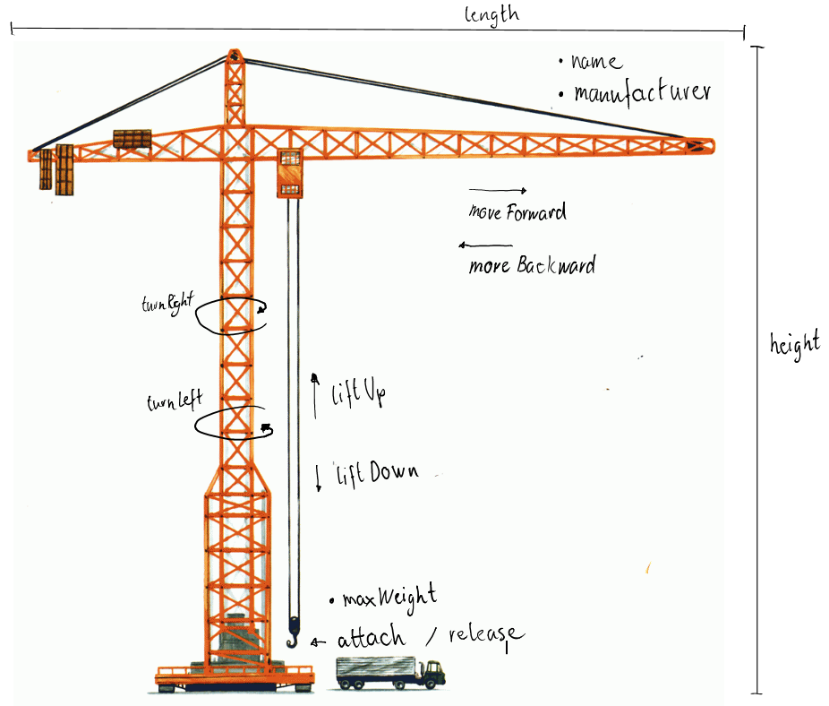

# Klassenvariablen und Methoden

Vorgehen:

* Erweiterung mit Getter und Setter Methoden zum Festlegen und Abfragen von privaten Variablen.
* Benutzerdefinierten Konstruktor
  * Name: Hubalot
  * Manufacturer: Cat
  * length 35m (davon 10m Rücken)
  * height 45m
  * Max weight 40'000kg
* Ergänzen Setter methoden mit Regeln:
  * Max length 40m (davon 10m Rücken)
  * Max height 45m
  * Max weight 50'000kg
  * Max range length-10m;
* Einen neuen Kran erstellen
  * Einmal mit Standardkonstruktor: Hubalot 1
  * Und einmal mit Benutzerdefinierten Konstruktor: Hubalot 2
* Klasse Lastwagen erstellen NUR mit Benutzerdefinierten Konstruktor
  * Name
  * Gewicht
* Lastwagen bereitstellen (gemäss Grafik)
* Anpassen Crane Attach methoden
  * Parameter Lastwagen.
  * Kran Lastwagen Property ergänzen.
  * Überprüfen Gewicht.
* Implementation: Lastwagen1 anheben um 10m.
  * Set range
  * attach
  * liftup
  * lift down
  * release

