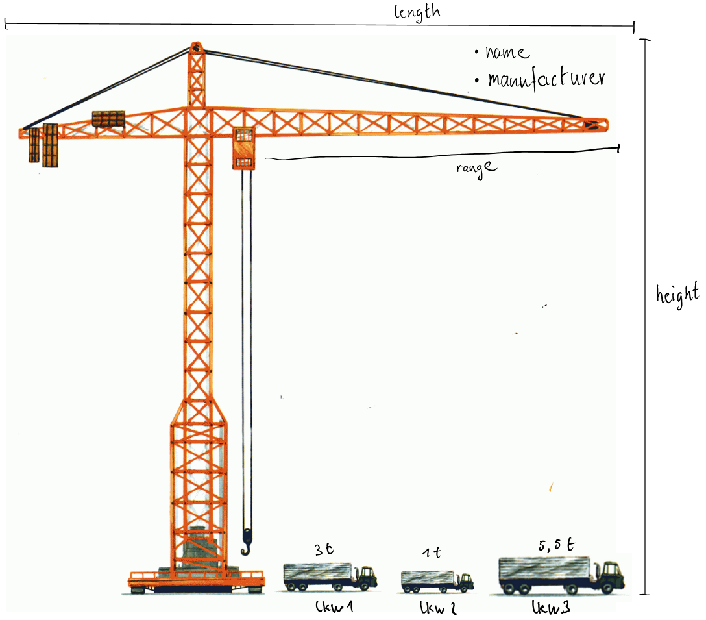

# Week 3

* Einführung in OOP (Objektorientiertes Programmieren)
* Lösen der Zusatzaufgabe Calculator

# Einführung OOP

Mit einer Software möchte man ein Problem lösen.

Unser Ziel: Kransteuerung

Objektorientiertes Programmieren verfolgt den Ansatz Objekte der Wirklichkeit in Modelle zu abstrahieren (vereinfachen). Das Werkzeug zur Beschreibung dieser Abstraktion ist die Programmiersprache.

Unser Beispiel: Kran

In einem ersten Schritt identifiziert man die Egenschaften (Properties) und Methoden (Methods) des darzustellenden Objekts.

Diese Informationen werden dann als Java Klasse implementiert.
